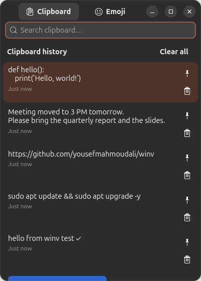
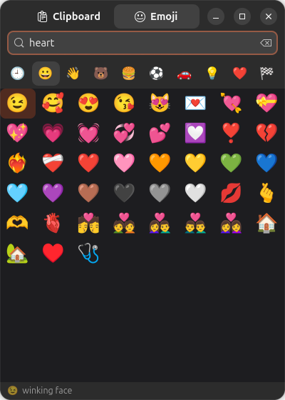

# WinV 📋✨

> A lightweight, native Linux alternative to the Windows **"Win + V"** clipboard history and emoji panel. Built for modern Linux desktops (GNOME, KDE Plasma, Hyprland, Sway, i3) with seamless **Wayland** and **X11** support.

<p align="center">
  
  &nbsp; &nbsp;
  
</p>

---

## ✨ Features

- **Continuous Text & Image History**:
  - Automatically captures clipboard modifications across all applications (terminal, browser, IDE, image viewers).
  - High-performance SQLite storage (WAL mode) with thumbnail caching.
  - Image preview with dimensions and format support (PNG, JPEG, WebP, etc.).
  - Text entries include character count and relative timestamps (*"Just now"*, *"5 min ago"*).
  - Deduplication with LRU ordering: re-copying an existing item bumps it to the top without creating duplicates.
  - Skips sensitive data flagged by password managers (KeePassXC, 1Password, Bitwarden).
- **Auto-Paste into Focused Window**:
  - Selecting an item or pressing <kbd>Enter</kbd> copies it to the active clipboard and automatically injects <kbd>Ctrl</kbd> + <kbd>V</kbd> into your previously focused application.
  - Press <kbd>Shift</kbd> + <kbd>Enter</kbd> to copy to clipboard without auto-pasting.
- **Searchable Emoji Palette**:
  - Full Unicode dataset (1,900+ emojis) with official CLDR search keywords.
  - Categorized tabs (Smileys, People, Animals, Food, Travel, Activities, Objects, Symbols, Flags).
  - Dedicated **"Recent"** category dynamically updated with your most-used emojis.
  - Selecting an emoji automatically inserts it into your active document or chat window.
- **Pinning & History Management**:
  - Pin important snippets or frequently used commands with <kbd>Ctrl</kbd> + <kbd>P</kbd> or the pin button.
  - "Clear all" wipes unpinned history while preserving your pinned items.
- **Lightning-Fast Shortcut Trigger**:
  - Instant opening via D-Bus activation (~30ms toggle latency).
  - Out-of-the-box shortcut bindings:
    - <kbd>Super</kbd> + <kbd>V</kbd> &rarr; Clipboard history
    - <kbd>Super</kbd> + <kbd>.</kbd> &rarr; Emoji palette

---

## 🏛️ Architecture & Design Rationale

### Why This Stack?
Under modern Linux display servers—especially **Wayland** with compositors like Mutter (GNOME Shell)—Wayland's security model deliberately restricts background applications from spying on clipboard selections and injecting arbitrary keystrokes into other windows.

WinV solves this cleanly without clunky workarounds or root daemons:

```
┌─────────────────────────────────────────────────────────────┐
│                       Clipboard Copy                        │
│             (Any Native Wayland or X11 Window)              │
└──────────────────────────────┬──────────────────────────────┘
                               │ (Mutter mirrors to Xwayland)
                               ▼
┌─────────────────────────────────────────────────────────────┐
│                 winv-watcher (Background)                   │
│           GDK X11 Backend (XFixes clipboard hook)           │
│         - Debounced capture & deduplication                 │
│         - Password manager secret suppression               │
│         - Saves text/images to SQLite & thumbnail cache     │
└──────────────────────────────┬──────────────────────────────┘
                               │ SQLite WAL (Instant sync)
                               ▼
┌─────────────────────────────────────────────────────────────┐
│               winv-ui (Resident Libadwaita App)             │
│            Native Wayland Client (Single Instance)          │
│         - Activated in <30ms via D-Bus (gdbus)              │
│         - Keyboard navigation & real-time search            │
│         - On pick: copies to clipboard & hides window       │
└──────────────────────────────┬──────────────────────────────┘
                               │
                               ▼
┌─────────────────────────────────────────────────────────────┐
│                  Auto-Paste Injection Engine                │
│    Primary: /dev/uinput kernel virtual keyboard (udev ACL)  │
│    Fallbacks: ydotool, xdotool (X11), wtype (wlroots)       │
└─────────────────────────────────────────────────────────────┘
```

1. **Clipboard Monitoring (`winv watch`)**: Runs a lightweight daemon with GTK on the X11/Xwayland backend. Since Mutter synchronizes Wayland and Xwayland clipboards, the daemon receives instant `XFixes` clipboard events without requiring window focus or root privileges.
2. **Interactive UI (`winv ui`)**: A resident, single-instance GTK 4 / Libadwaita popup running on native Wayland so it receives proper focus, styling, and animations. When you press <kbd>Super</kbd> + <kbd>V</kbd>, the shell sends a D-Bus action token via `gdbus`, displaying the popup in milliseconds.
3. **Keystroke Injection (`/dev/uinput`)**: To paste into the target window across Wayland and X11 without requiring elevated permissions or third-party background daemons, WinV creates an ephemeral kernel input device through `/dev/uinput` using a standard `uaccess` udev rule (the same mechanism used by Steam and gamepads).

---

## 🚀 Quick Start & Installation

### Option 1: Automated 1-Step Install (Recommended)

Clone the repository and run the installer:

```bash
git clone https://github.com/yousefmahmoudali/winv.git
cd winv
chmod +x install.sh
./install.sh
```

The script will:
1. Detect your package manager (`apt`, `dnf`, `pacman`, `zypper`) and install necessary dependencies.
2. Install the application files and desktop entry into `~/.local/`.
3. Set up the `/dev/uinput` udev rule for seamless Wayland auto-paste.
4. Enable and start the user `systemd` background services.
5. Automatically configure <kbd>Super</kbd> + <kbd>V</kbd> and <kbd>Super</kbd> + <kbd>.</kbd> on GNOME.

> **Note on Wayland Auto-Paste**: If `/dev/uinput` permissions were just created, log out and log back in once for systemd-logind to apply the device access tags to your user session.

---

### Option 2: Manual Keybinding Configuration

If you use a desktop environment or window manager other than GNOME, bind the commands as follows:

| Environment | Config Location | Keybinding Line |
| :--- | :--- | :--- |
| **Hyprland** | `~/.config/hypr/hyprland.conf` | `bind = SUPER, V, exec, ~/.local/bin/winv toggle`<br>`bind = SUPER, period, exec, ~/.local/bin/winv emoji`<br>`windowrulev2 = float, class:^(io.github.winv.WinV)$` |
| **Sway** | `~/.config/sway/config` | `bindsym Mod4+v exec ~/.local/bin/winv toggle`<br>`bindsym Mod4+period exec ~/.local/bin/winv emoji`<br>`for_window [app_id="io.github.winv.WinV"] floating enable` |
| **i3wm** | `~/.config/i3/config` | `bindsym Mod4+v exec ~/.local/bin/winv toggle`<br>`bindsym Mod4+period exec ~/.local/bin/winv emoji`<br>`for_window [class="io.github.winv.WinV"] floating enable` |
| **KDE Plasma** | *System Settings &rarr; Shortcuts* | Add Custom Command: `~/.local/bin/winv toggle` &rarr; Shortcut: <kbd>Meta</kbd> + <kbd>V</kbd> |

---

## ⌨️ Keyboard Shortcuts

| Shortcut | Action |
| :--- | :--- |
| <kbd>Super</kbd> + <kbd>V</kbd> | Toggle clipboard history popup |
| <kbd>Super</kbd> + <kbd>.</kbd> | Toggle emoji picker popup |
| <kbd>↑</kbd> / <kbd>↓</kbd> | Navigate through items or emoji |
| <kbd>Enter</kbd> | Select item, copy, and auto-paste into target window |
| <kbd>Shift</kbd> + <kbd>Enter</kbd> | Copy item to clipboard without auto-pasting |
| <kbd>Ctrl</kbd> + <kbd>P</kbd> | Pin / Unpin the highlighted clipboard item |
| <kbd>Delete</kbd> | Delete selected clipboard item |
| <kbd>Ctrl</kbd> + <kbd>Tab</kbd> or <kbd>Alt</kbd> + <kbd>1</kbd>/<kbd>2</kbd> | Switch between Clipboard and Emoji tabs |
| <kbd>Esc</kbd> | Close popup |

---

## ⚙️ Configuration

WinV creates a commented configuration file at `~/.config/winv/config.toml` on first launch:

```toml
# Maximum number of unpinned history entries to retain
max_items = 100

# Maximum size (in characters) of text clipboard entries to store
max_text_chars = 500000

# Maximum image resolution (in megapixels) to record
max_image_megapixels = 40

# Automatically simulate paste keystroke after picking an item
auto_paste = true

# Key combination sent to paste ("ctrl+v", "ctrl+shift+v", or "shift+insert")
paste_keys = "ctrl+v"

# Delay (ms) before injecting keystroke to allow target window to regain focus
paste_delay_ms = 180

# Keystroke backend ("auto", "uinput", "ydotool", "xdotool", "wtype", "none")
paste_backend = "auto"

# Close popup window when it loses focus
hide_on_focus_loss = true
```

After modifying settings, restart the user services:
```bash
systemctl --user restart winv-ui winv-watcher
```

---

## 🩺 Diagnostics & Health Check

WinV includes a built-in doctor command to verify your desktop environment, permissions, and active services:

```bash
winv doctor
```

Example output:
```text
Session: wayland   Desktop: ubuntu:GNOME

 ✔ GTK 4 + libadwaita
 ✔ DISPLAY set (needed by the watcher via Xwayland)
 ✔ python-evdev installed
 ✔ /dev/uinput writable (auto-paste)
 ✔ winv-watcher.service running
 ✔ winv-ui.service running
 ✔ GNOME Super+V shortcut configured

Config: /home/user/.config/winv/config.toml
Data:   /home/user/.local/share/winv
auto_paste=true paste_backend=auto paste_keys=ctrl+v
```

---

## 🗑️ Uninstallation

To completely remove WinV:

```bash
./uninstall.sh
```

To also delete all saved clipboard history, images, and configuration:
```bash
./uninstall.sh --purge
```

---

## 📄 License

This project is licensed under the [MIT License](LICENSE).
